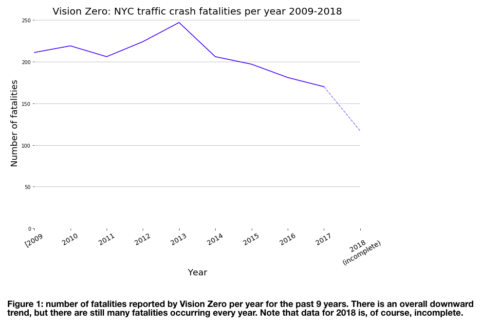

## Assignment 1

Using the specified MTA data from 2010 to 2014, perform an analysis to find outliers, trends, and build and evalutate decision tree models. 

## Assignment 2

Update my plot from homework 8, taking into account the suggestions from my classmates. The following changes have been made:

* Change the y-axis label from "Fatalities" to "Number of fatalities" to increase clarity.
* Increase the font size of the caption for improved readability.
* Create a line plot instead of a bar plot, which is more appropriate given the time-based nature of my data.
* Change the label for the 2018 data on the x-axis to make it visually apparent that incomplete data is being plotted.

In addition, the line segment between 2017 and 2018 has been made transparent (`alpha=0.5`) and dotted (`linestyle="--"`) as a further visual aid to show that something is different about the 2018 data.

